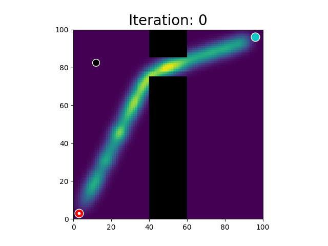

# LearningSamplingDistributionsUsingCVAE

## Requirements:
* Python 3.x (I confirm that the scripts run in Python 3.8.10)
* pytorch 1.9.1+cu111
* numpy 1.20.3
* wandb (optional): if you don't want to use wandb for tracking the training process, type 'no' in wandb at globals.ini in configs/.
* matplotlib 3.3.0 (for visualizing results)
* colorama 0.4.3
* scipy 1.7.3
* imageio & imageio--ffmpeg 2.14.1 & 0.4.5
* moviepy 1.0.3
* sklearn
* cv2

## Descrition: 
This repository aims to learn the sampling distribution of RRT or RRT* algorithm.  
It implements the learned sampling module, which samples a random sample that may lie at the optimal path.  
The optimal path is predicted by the conditional variational auto-encoder (CVAE) model.  
The model gets an environment image as a conditional value and generates random samples.  
With a probability _lambda, the learned sample is used. Otherwise, uniform sampling is applied.  
The detailed descriptioin is on [this paper](https://arxiv.org/abs/1709.05448).  

## Dataset:
* [**motion_planning_datasets**](https://github.com/mohakbhardwaj/motion_planning_datasets.git)  
: motion_planning_datasets include several different environments.  

## How to use:
* Gather a data
```
{repository} $ python{PYTHONV} learned_sampling.py --data_gather True
```
This step gather a data which contains environment images and the samples that may lie at the optimal path.  
This (sub) optimal path is obtained with RRT* within a constant iteration.  
Output results is '{environment_name}_env_sample.pickle'. The pickle file is used to train the CVAE model.  

* Train a model
```
{repository} $ python{PYTHONV} learned_sampling.py --train True
```

* Test a model
```
{repository} $ python{PYTHONV} learned_sampling.py --test True --model_path ./checkpoints/{SOME_CHECKPOINT_FILE}.pt
```

## Trained results


## futher detail of this repo.   
* **learned_sampling.py**: main fuction for running whole scripts.  
* **cvae_sampler.py**: Training / Evaluating / Testing a model.  
* **env_2d.py**: a basic class for dealing with the environments, such as visualizing or collision checking, etc.  
* **rrt2d.py**: rapidly-exploring random tree (RRT) path planning algorithm. It assumes a 2d-environment.  
* **rrtstar2d.py**: optimal-variant RRT (RRT*) path planning algorithm. It assumes a 2d-environment.    
* **rrt_algorithm_example.py**: Examples for using RRT algorithm.  
* **utils.py**: some utitlity functions, mainly preprocessing data. 

### References.

**Please contact me (msk930512@snu.ac.kr) if you have any questions.**

